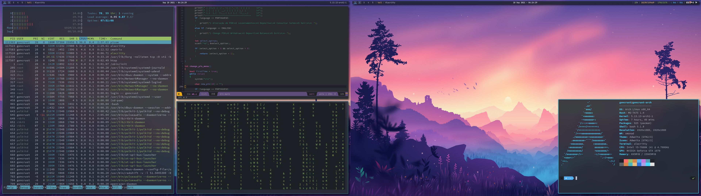

# dotfiles

The config files I use in my machines.

## Info

- My macOS dotfiles are under the directory [**mac**](https://github.com/goncrust/dotfiles/tree/main/mac)
- In macOS I try to simulate a Tiling Window Manager with the following (good guide [here](https://www.notion.so/Yabai-8da3b829872d432fac43181b7ff628fc), by [Jesse Skelton](https://www.youtube.com/channel/UC7syy0V3Ah9Ho4eRUCwRsRg)):
  - [yabai](https://github.com/koekeishiya/yabai) (managing windows position and size)
  - [skhd](https://github.com/koekeishiya/skhd) (keybindings)
  - [limelight](https://github.com/koekeishiya/limelight) (window borders)
  - zsh aliases `wmstart` and `wmstop` to activate and deactivate the Tiling Window Manager mode
- In [**utm-debian**](https://github.com/goncrust/dotfiles/tree/main/utm-debian) are dotfiles for the debian virtual machine I use in macOS, with [UTM](https://github.com/utmapp/UTM)
- Some wallpapers I like under [**wallpapers**](https://github.com/goncrust/dotfiles/tree/main/wallpapers) and all the fonts I use in [**fontslist.txt**](https://github.com/goncrust/dotfiles/blob/main/fontslist.txt)

## Screenshots

### [XMonad] Arch

