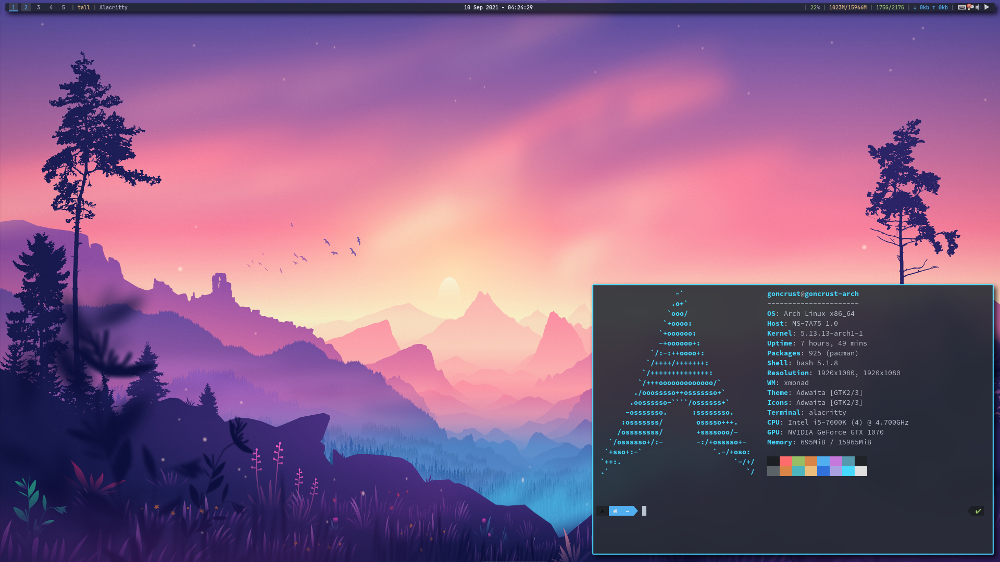
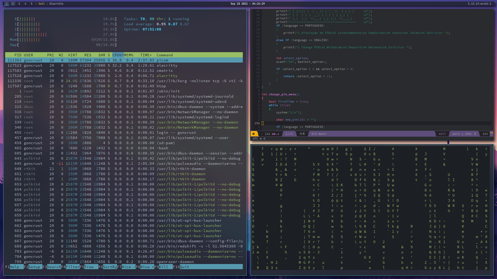
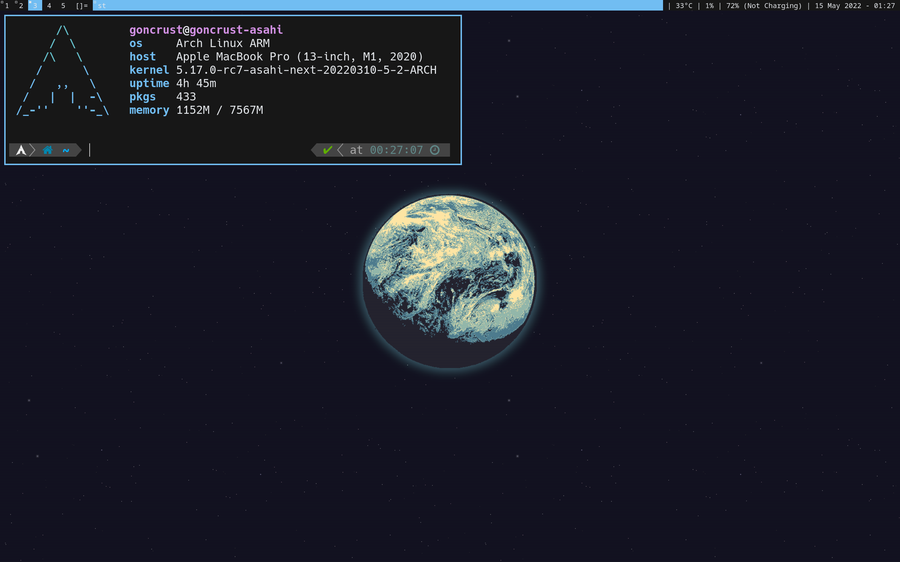

# dotfiles

The config files I use in my machines.

## Info

- I use **XMonad** on my main system (running arch) and **DWM** on my Thinkpad T480 (running arch) and MBP (running [**Asahi Linux**](https://asahilinux.org/))
    - Asahi dotfiles are under [**asahi-linux**](https://github.com/goncrust/dotfiles/tree/main/asahi-linux)
    - Specific dotfiles for the T480 are under [**t480**](https://github.com/goncrust/dotfiles/tree/main/t480)
- Sometimes I use macOS, dotfiles are under [**mac**](https://github.com/goncrust/dotfiles/tree/main/macos)
    - On macOS I try to simulate a Tiling Window Manager with the following (good guide [here](https://www.notion.so/Yabai-8da3b829872d432fac43181b7ff628fc), by [Jesse Skelton](https://www.youtube.com/channel/UC7syy0V3Ah9Ho4eRUCwRsRg)):
      1. [yabai](https://github.com/koekeishiya/yabai) (managing windows position and size)
      1. [skhd](https://github.com/koekeishiya/skhd) (keybindings)
      1. [limelight](https://github.com/koekeishiya/limelight) (window borders)
      1. zsh aliases `wmstart` and `wmstop` to activate and deactivate the Tiling Window Manager mode
- Some wallpapers I like [**here**](https://github.com/goncrust/dotfiles/tree/main/wallpapers).

## Screenshots

### [XMonad] Desktop (Arch)

### [DWM] T480 (Arch) and MBP (Asahi)

